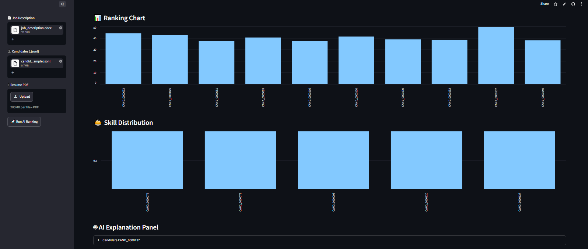

<div align="center">

<a href="https://github.com/shivagundeti2005/AI_Candidate_Ranking_System">
  
</a>

#  AI Candidate Ranking System

### Intelligent Resume Screening & AI-Powered Candidate Ranking Platform

<p align="center">
An AI-powered recruitment solution that automates resume screening, extracts candidate skills using NLP, and ranks applicants based on their relevance to the job description.
</p>

<p align="center">


</p>

</div>

---

# 📖 About The Project

The **AI Candidate Ranking System** is an intelligent recruitment platform designed to automate resume screening and candidate ranking.

Traditional hiring requires recruiters to manually review hundreds of resumes, making the process slow and error-prone.

This project leverages **Artificial Intelligence**, **Natural Language Processing (NLP)**, and **Machine Learning** techniques to analyze resumes, extract candidate information, compare it against the job description, and generate an intelligent ranking score.

The system significantly reduces manual effort while improving hiring accuracy and decision-making.

---

# ✨ Key Features

✅ AI-based Resume Screening

✅ Resume Parsing (PDF)

✅ Skill Extraction using NLP

✅ Experience Analysis

✅ Education Detection

✅ Candidate Scoring

✅ Candidate Ranking

✅ CSV Submission Generation

✅ Interactive Visualizations

✅ Data Analysis Dashboard

---

# 🖥️ Project Screenshots

## 📊 Candidate Ranking Results

<p align="center">
  
</p>

<p align="center">
  
</p>

<p align="center">
  
</p>

<p align="center">

</p>

---

## 🏗️ System Architecture

<p align="center">
  
</p>

---

# ⚙️ Workflow

```text
Job Description
        │
        ▼
Resume Collection
        │
        ▼
Resume Parsing (NLP)
        │
        ▼
Data Cleaning
        │
        ▼
Skill & Experience Extraction
        │
        ▼
Feature Engineering
        │
        ▼
Candidate Matching
        │
        ▼
AI Ranking Engine
        │
        ▼
Ranked Candidate List
        │
        ▼
Recruiter Dashboard
```

---

# 🧠 AI Pipeline

```
Resume Upload
      │
      ▼
PDF Parser
      │
      ▼
Text Extraction
      │
      ▼
NLP Processing
      │
      ▼
Skill Extraction
      │
      ▼
Similarity Calculation
      │
      ▼
Ranking Score
      │
      ▼
Top Candidates
```

---

# 🛠️ Tech Stack

| Technology | Purpose |
|------------|---------|
| Python | Core Development |
| Pandas | Data Processing |
| NumPy | Numerical Computation |
| Scikit-Learn | Machine Learning |
| NLP | Resume Analysis |
| Matplotlib | Visualization |
| CSV | Output Generation |
| Jupyter Notebook | Development |

---

# 📂 Project Structure

```
AI_Candidate_Ranking_System
│
├── Assests/
│   ├── logo.png
│   ├── Architecture_Flow.png
│   ├── charts.png
│
├── dataset/
│   ├── resumes/
│   ├── job_description.csv
│
├── output/
│   └── submission.csv
│
├── notebooks/
│
├── src/
│
├── requirements.txt
│
├── README.md
│
└── main.py
```

---

# 🚀 Installation

```bash
git clone https://github.com/shivagundeti2005/AI_Candidate_Ranking_System

cd AI_Candidate_Ranking_System
```

Install dependencies

```bash
pip install -r requirements.txt
```

Run

```bash
python main.py
```

---

# 📈 Output

The system generates

- Ranked Candidate List
- Candidate Scores
- Resume Insights
- CSV Submission
- Charts & Visualizations

---

# 🎯 Future Enhancements

- Resume Recommendation System
- AI Chat Assistant
- Interview Prediction
- ATS Compatibility
- Recruiter Dashboard
- Cloud Deployment
- LLM Integration
- Real-time Resume Analysis


---

---
<div align="center">

## Thank You for Exploring This Project

This repository demonstrates the application of **Artificial Intelligence**, **Machine Learning**, and **Natural Language Processing** to streamline candidate screening and improve recruitment efficiency.

Your feedback, suggestions, and contributions are always appreciated.

If you found this project valuable, please consider giving it a ⭐ to support future development.

### Developed by **Shiva Gundeti**

🌐 **Portfolio:** https://shivakumargundetiportfolio.netlify.app/  
💻 **GitHub:** https://github.com/shivagundeti2005  
📧 **Email:** shivakumargundeti5@gmail.com
📱 **Phone:** +91 6302667395 

*Empowering smarter hiring through AI-driven innovation.*

</div>
